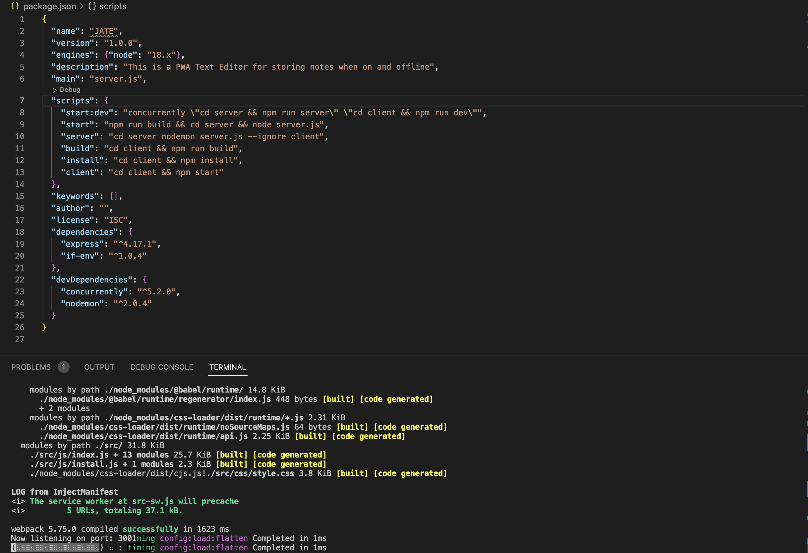
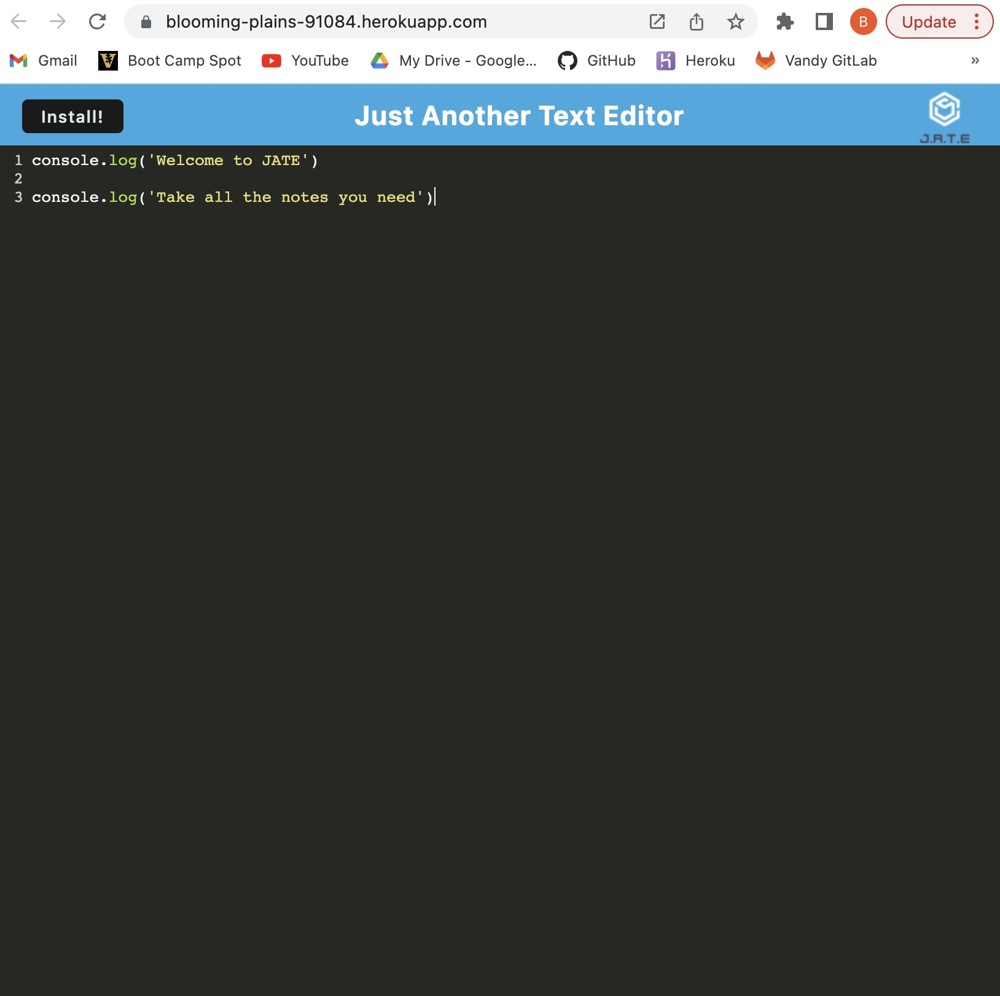
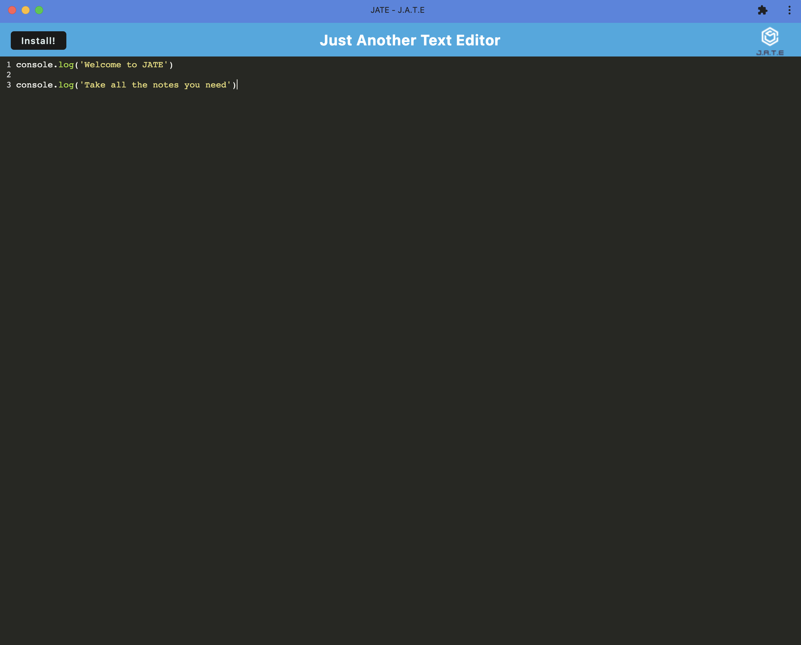

# PWA_Text_Editor_via_idb

This project was completed in order to give clients a simple text editor application that can be utilized while on and off line.

## GitHub Repository

[PWA_Text_Editor_via_idb](https://github.com/Brad-Hambrick/PWA_Text_Editor_via_idb)

## Deployed Application via Heroku

[PWA_Text_Editor_via_idb](https://blooming-plains-91084.herokuapp.com/)

## Description

This project was completed in order to showcase my knowledge working with progressive web applications and utilizing webpacks in order to configure a full stack web application in which front and back end components can run independently or concurrently. This text editor also gives the user the ability to save notes and code snippets while off line as well.

## Badges

All of the coding methods in this project were those that were learned during the Vanderbilt Coding Bootcamp. This was a refactor project, so a large portion of the code was provided and then code was added to make the application functional.

## Visuals

## Usage

This project is a full stack web application that allows users the use of a text editor while on and off grid to keep track of all coding thoughts.

## Support

For support, contact Brad Hambrick @bradleyhambrick@gmail.com

## Roadmap

This project is complete to the point of basic functionality but could potentially have updates and improvements in the future.

## Contributing

This project is open to recommendations and future contributions.

## Authors and acknowledgment

Thanks to Vanderbilt Coding Bootcamp for contributing to the knowledge required to build this project.

## License

The basis of this application's code was provided by the Vanderbilt University Coding Bootcamp via the [cautious-meme](https://github.com/coding-boot-camp/cautious-meme) github repository. The remainder of the code applied to reach functionality was added by Brad Hambrick.

## Project status

The project is operational however could receive updates and improvements in the future.
